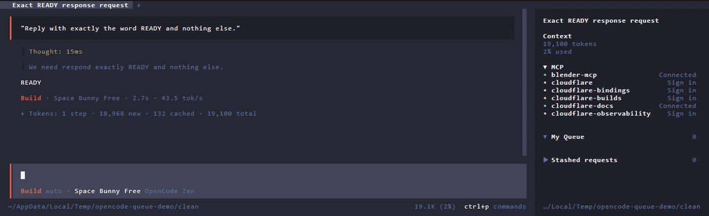

# opencode-queue

A task queue you own for an [OpenCode 2](https://opencode.ai) session, which the agent can work through on its own.



## The problem

You are watching an agent refactor authentication middleware when three follow-ups occur to you. You send the first one
mid-run and something predictable happens:

1. The agent stops what it was doing.
2. It handles your new request.
3. It asks whether to continue with the original task.

The first task was not abandoned so much as interrupted, and interruptions are expensive. The model re-reads context,
re-decides, and often repeats work it had already finished.

This is a queueing problem, not a prompting problem. There is nowhere to put a follow-up that means "after this, not
now".

OpenCode V1 had a `todowrite` tool, but that list belonged to the model. It was the agent's own scratchpad for the
task in front of it, so it cannot help here: the problem is a message the agent has not received yet. V2 removed the
tool outright, described upstream as
[intentional](https://github.com/anomalyco/opencode/issues/42421#issuecomment-1).

`opencode-queue` is the other kind of list. It belongs to you, it survives turns, and the agent can drain it in order.

## Install

```sh
opencode plugin add github:Double77x/opencode-queue
```

Restart OpenCode afterwards. Requires OpenCode 2.0 or newer.

## The loop

```sh
/queue-add something you just thought of   # capture it, keep working
/queue-list                                  # what is queued
/queue-run                                   # take the next one
/queue-done                                  # tick it off
```

Nothing is ever submitted for you, and the agent cannot read your queue unless you arm auto-run.

## Auto-run

`/queue-auto` lets the agent work through the queue unattended. Arming starts the run straight away, and again after
every task: the agent is handed the next one, calls `queue_done` when it finishes, and the one after that follows. The
GIF above is that loop, recorded live.

```sh
/queue-auto          # arm for this session
/queue-auto-status   # what is armed, how much is left
/queue-auto          # again, to turn it off
```

This is the only mode in which the plugin submits a prompt, and it is fenced:

- **Per session.** Other sessions, worktrees and locations are never touched.
- **Budgeted.** Ten tasks by default. Running out stops the run; `/queue-auto` rearms it.
- **No loops.** If a task is handed over and never ticked off, the run pauses instead of resubmitting it.
- **Fails closed.** A corrupt or hand-edited `.opencode/autorun.json` reads as _off_, never as consent. Delete the file
  to disarm it.

While armed, the agent gets two tools, `queue_list` (read-only) and `queue_done`. Both refuse when auto-run is off, so
the agent still cannot read your queue in the default mode.

It also spends real model turns with nobody watching. That is the point, and also the risk.

## Commands

| Command              | What it does                                                  |
| -------------------- | ------------------------------------------------------------- |
| `/queue-add`         | Capture a task for this session.                              |
| `/queue-list`        | Print the queue.                                              |
| `/queue-run`         | Pick a task. Does not submit it, see the limitation below.    |
| `/queue-done`        | Mark a pending task complete.                                 |
| `/queue-reopen`      | Return a completed task to pending.                           |
| `/queue-edit`        | Edit a task. Editing a completed task makes it pending again. |
| `/queue-remove`      | Delete a task.                                                |
| `/queue-clear`       | Confirm, then clear this session's queue.                     |
| `/queue-auto`        | Toggle unattended auto-run.                                   |
| `/queue-auto-status` | Report auto-run state.                                        |

Every command is also in the command palette.

## Sidebar

Two collapsible sections:

- **My Queue** holds this session's tasks, with a live count. Completed ones are dimmed and struck through. While the
  section is collapsed its header carries a badge such as `auto-run 0/10 · /queue-auto off`, the way OpenCode's own MCP
  section summarises itself.
- **Stashed requests** holds prompts you already sent that the agent has not picked up. Auto-run drains your queue, not
  the OpenCode inbox, so this is the only sign that a message of yours is stuck.

Both collapse on click.

## Storage

Everything lives in `.opencode/` in the project, as readable JSON.

| File           | Holds                                                           |
| -------------- | --------------------------------------------------------------- |
| `queue.json`   | Your tasks. Add it to `.gitignore`; task text can be sensitive. |
| `autorun.json` | Auto-run arming. No task text. Delete it to disarm.             |

Both are written atomically with an fsynced replace under a cross-process file lock, so several OpenCode windows can
work in the same project without losing each other's writes. A file that cannot be parsed is moved aside as
`queue.json.corrupt-<timestamp>` rather than silently overwritten.

## Limitations

- **`/queue-run` cannot prefill the composer.** OpenCode 2 has no public API for putting text into the native composer,
  so the command picks a task and stops. Tracked at
  [anomalyco/opencode#51209](https://github.com/anomalyco/opencode/issues/51209).
- **A finished turn cannot tell "done" from "waiting for you".** The plugin reacts to the end of a model turn, which
  looks the same whether the agent finished the task or stopped to ask. A task that is handed over and never ticked off
  pauses the run instead of being retried.
- **Auto-run is one session at a time.** Arming a second session replaces the first.
- **An armed run only picks up tasks that were queued before it started.** A task added to an already-armed queue waits
  until that run finishes and you arm again.

## Development

```sh
bun install
bun run check
```

`check` runs formatting, lint, a strict typecheck and the test suite. Tests use real files and real child processes. The
cross-process locking test spawns four concurrent writers and asserts that none are lost.

Start OpenCode against this checkout with `bun run dev`. To regenerate `docs/demo.gif`, see `script/demo.sh`.

## Licence

MIT.
